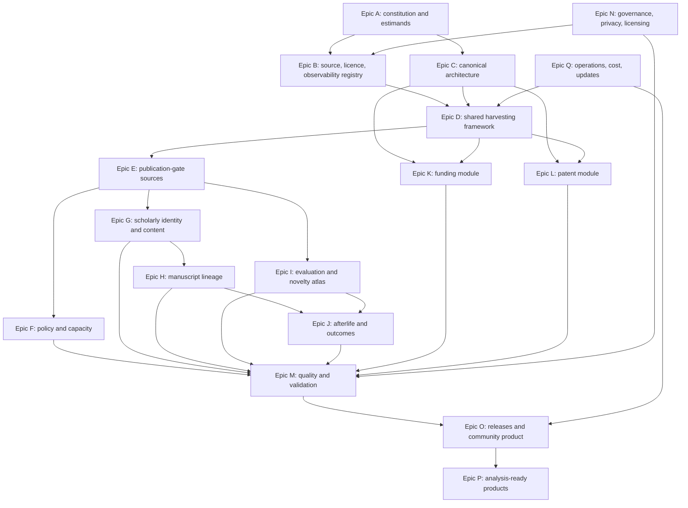

# Ticketbook — Open Selection Graph (OSG)

**Date:** 2026-08-10. **Mode:** full, extended, maximally ambitious public-data build.
**Research basis:** `docs/DATASET_OPPORTUNITY_RESEARCH.md`, `RESEARCH_PROGRAMME.md`, and the current P/P1/P2/P4 manuscripts.

**Hard constraints.** No bespoke data partnerships; no new human subjects; no paid data or model APIs; no source whose usable access depends on a paid tier. Public endpoints, public bulk files, open repositories, free unauthenticated APIs, and genuinely free account-gated services are allowed after a terms/licence review. Modal compute is allowed up to the existing **$30 total account balance**, with programmatic cost stops. Credentials are configuration, never data: no token, password, account email, or secret may enter Git, logs, manifests, notebooks, job arguments, or release artifacts.

**Ambition.** “Maximal” means full coverage of every source that passes the observability, legal, ethical, and reproducibility gates—not indiscriminate scraping. It means the most complex defensible join across candidate pools, decisions, evaluations, policy, capacity, versions, trajectories, and outcomes. It does not mean claiming unobserved submission stages, redistributing text without a licence, or buying access to make the record look larger.

**Priority.** P0 = validity, safety, or reproducibility blocker. P1 = required for the flagship community release. P2 = high-value extension. P3 = useful only after the flagship is stable.

**Effort.** S (<1 day), M (1–3 days), L (~1 week), XL (2–4 weeks), XXL (>1 month or a continuously maintained source family).

**Scale.** 17 epics, 164 execution tickets, six release waves (R0–R5), and a staged 10–15 month maximal path for one primary researcher.

**Ticket discipline.** Every empirical ticket has an acceptance criterion and a failure/kill or downgrade rule. Procedural tickets are labelled **gate**. If a source fails, the failure is preserved in the source registry; it is never silently dropped. No scientific claim may move from exploratory to confirmatory without a frozen snapshot, registered estimand, and code hash.

---

## 0. Strategic analysis — what will make or break this dataset

### (a) The product is a process graph, not a review corpus

Review text, PDFs, scores, and decisions already exist in several large public corpora. Reharvesting them into a larger table would be useful engineering but a weak scientific contribution. OSG earns its name only if it joins the missing institutional layer:

- which candidate pool is actually observable;
- at which selection stage;
- under which rules and rubric version;
- with what demand, capacity, evaluator supply, and timing;
- through which revisions and later gates;
- with what downstream scientific afterlife.

The primary unit is therefore `gate_cycle`, not `paper`. Every source adapter must terminate in a gate-cycle record and a coverage record, even if its paper/review extraction is excellent.

### (b) “All submissions” is the most dangerous field in the project

OpenReview invitations vary; Copernicus hides access review; eLife hides the decision to send for review; TMLR hides desk rejections; PLOS review histories are author opt-in and accepted-only; funding portals frequently expose only panel-stage records or winners; patent datasets omit non-public applications. These are different populations.

OSG uses five observability grades:

| Grade | Meaning | Permitted use |
|---|---|---|
| **A — entry-complete** | Provider totals and records cover the earliest submitted pool, including withdrawals/rejections | Selection and stage-transition estimates from entry |
| **B — stage-complete** | Complete after a named hidden screen; denominator verified at that stage | Conditional selection estimates only |
| **C — selected/opt-in history** | Reviews or histories exist only for selected/accepted/opt-in works | Evaluation-process description; no candidate-pool selection estimate |
| **D — outcome registry** | Winners/publications/outcomes with no comparable candidate pool | Portfolio/outcome description only |
| **U — unresolved** | Coverage or stage cannot be established | Quarantine; no substantive analysis |

Grades attach to `source × gate_cycle × object_type`, not to a provider forever. A venue can change platform conventions or disclosure policy over time.

### (c) Source breadth can create false comparability

A conference quota, a rolling threshold journal, a two-stage public discussion, a publish-review-curate venue, a funder panel, and patent examination do not share one binary outcome. The common schema must preserve native stages and rules before normalization. “Reviewed preprint,” “discussion paper,” “major revision,” “fundable,” and “notice of allowance” are not synonyms for acceptance.

The project will fail if normalization destroys institutional architecture. Every normalized field therefore retains the native label, native scale, source text/pointer, and policy version.

### (d) Linkage error attacks the programme's strongest future designs

Cross-gate manuscript comparisons, rejected-work afterlives, resubmission success, and version-level novelty all depend on entity resolution. False positive links manufacture trajectories; false negatives erase them. Author names are incomplete or anonymized at submission time, titles change, papers split and merge, and later versions are treatment-affected.

The release must contain separate high-precision and discovery linkage layers, evidence features for every inferred edge, and source-declared links whenever possible. An opaque “same paper” classifier is not sufficient.

### (e) Text scale and licensing, not API access, are the main engineering constraints

Metadata and relations are usually cheap. PDFs, OCR, bibliographies, version alignment, and embedding reference corpora dominate storage and compute. Many article licences permit access but not republication. The architecture must be pointer-first and content-addressed: retain full text only when permitted and necessary; otherwise retain source identifiers, cryptographic hashes, extraction manifests, and non-reconstructive derived features.

No paid API is needed. Crossref, OpenAlex, arXiv, Europe PMC, OpenReview, Copernicus, public funder files, USPTO bulk datasets, and public repository releases supply the core. Scopus, Web of Science, Dimensions, PATSTAT, Altmetric, Lens paid services, commercial LLM APIs, and paywalled bulk feeds are out of scope by design.

### (f) The $30 compute balance must buy irreducible work

Modal is reserved for jobs whose elapsed time or memory makes local execution impractical: batched open-model embeddings, OCR/TEI parsing, and selected reference-corpus transforms. API retrieval, HTML/XML parsing, joins, policy extraction, audits, and release construction run locally. Every Modal job must have a 1% pilot, a projected upper cost, a per-job stop, resumable shards, and an artifact hash. The total recorded spend may not exceed $30; 20% remains contingency until the final full-scale feature pass.

### (g) Public does not mean ethically frictionless

The scientific value lies at institution and document level, not in ranking individual reviewers. OSG must not deanonymize, infer hidden identities, join pseudonymous reviewers to external profiles, expose contact details, or create personnel-evaluation tools. Stable reviewer pseudonyms may be retained only where needed for workload/reliability analysis and only in a protected analysis view; public releases default to coarser or salted identifiers.

### (h) The funding module has an irreducible ceiling

Public application lists and repeated-title trajectories can improve P4 substantially. They cannot recover undisclosed treatment arms, eligible bands, unfunded full text, or applicant histories. The module must encode P4's evaluability verdict and return `not_identified` when required fields are absent. This is a feature of the product, not a limitation to hide.

### (i) The patent module must avoid becoming a fourth NLP benchmark

PANORAMA, Patent-CR, PatRe, OARD, PatEx, and other public releases already cover decision trails, claim revisions, and office-action tasks. The programme's additionality is institutional and population-scale: examiner workload, art-unit heterogeneity, policy/time shocks, claim survival, scientific prior art, and a comparative theory of expert novelty judgment.

### (j) A maximal scrape without a release standard is a private data swamp

The durable contribution is a versioned public standard: schema, coverage ledger, policy archive, source adapters, reproducible rebuilds, validation artifacts, analysis views, and community documentation. Each wave must be releasable independently. The project is not “done” when raw bytes have been downloaded.

---

## 1. Target products and release ladder

### 1.1 Core graph

```text
gate ──< gate_cycle ──< policy_version
  │          │
  │          ├──< capacity_observation
  │          ├──< coverage_observation
  │          └──< candidate_gate_event >── candidate ──< candidate_version
  │                                              │               │
  │                                              │               ├──< evaluation
  │                                              │               ├──< decision_event
  │                                              │               └──< content_artifact
  │                                              │
  │                                              ├──< lineage_edge >── candidate/version
  │                                              └──< downstream_outcome
  └──< source_object ──< provenance_event
```

### 1.2 Public release waves

| Wave | Contents | Scientific threshold |
|---|---|---|
| **R0 — Constitution** | schema, source registry, policy schema, observability grades, licences, 100-record fixtures | Every claim and field has a provenance/coverage rule |
| **R1 — Architecture triangle** | ICLR/TMLR, Copernicus/EGUsphere, eLife; policies, evaluations, versions, outcomes | ≥3 distinct architectures, ≥2 domains, ≥2,000 evaluated non-ML negative outcomes |
| **R2 — Publication-gate atlas** | full passing OpenReview venues; F1000-family, SciPost, PeerJ/PLOS/EMBO/Royal Society and other transparent histories; Crossref discovery layer | All sources graded; selection analyses restricted to A/B pools |
| **R3 — Trajectories and strain** | cross-gate lineages, version diffs, reviewer/capacity proxies, rejected-work afterlife | Analysis-grade linkage precision ≥0.97; capacity variables have source-specific validity notes |
| **R4 — Funding and patents** | public funding evaluability/trajectory graph; USPTO institutional gate panel | Each module independently releasable and explicit about non-observable populations |
| **R5 — OSG 1.0** | integrated graph, stable IDs, public data package, explorer, rebuild tools, benchmark tasks, data paper | Rebuild, legal, privacy, coverage, and external-use gates all pass |

### 1.3 Paper leverage

| Programme component | Highest-value new evidence |
|---|---|
| **P** | joint accepted/rejected calibration; finite evaluator/capacity mechanisms; cross-architecture lock-in; structured idea/version representations |
| **P1** | repeated gate-cycle panel with demand, capacity, policy, strictness, selected outcomes, lags, and reforms |
| **P2** | native evaluator constructs across doors; many cycles; non-ML negatives; cross-gate same-work comparisons; version-aware novelty |
| **P4** | executable evaluability standard; public application denominators where available; resubmission trajectories; prospective instrument monitoring |
| **Extended programme** | architecture comparison, capacity strain, rejected-work afterlife, plural novelty constructs, transparency/evaluability, patent comparison |

---

## 2. Dependency map and critical path



**Critical path:** A → B/C → D → E → G/H/I/J → M → O. Funding and patents are parallel extensions once the common schema and harvest framework are stable. No population-scale source pull starts before its source card and 100-record fixture pass.

---

## Epic A — Constitution, estimands, and claim discipline

**Outcome:** a dataset whose permissible claims are determined by observable fields rather than by researcher convenience.

### A1 — Freeze OSG constitution — P0, M, gate

**Work.** Write `docs/observatory/CONSTITUTION.md`: hard constraints, primary unit, observability grades, stage-conditioned claim rules, no-paid-API rule, no-deanonymization rule, versioning policy, and governance authority. Define amendment procedure and semantic versioning.

**Acceptance.** Every later epic cites a constitution version; automated release checks fail if a source, field, or analysis has no grade or provenance class.

### A2 — Define target estimands by paper and architecture — P0, L

**Work.** Create a machine-readable estimand registry covering P/P1/P2/P4 and future analyses. For each estimand record population, intervention/exposure, comparator, outcome, time, required stage, required fields, admissible grades, and known non-identification conditions.

**Acceptance.** At least 20 estimands are registered; a validator can return `identified`, `partially_identified`, or `not_identified` for every `estimand × gate_cycle` pair.

**Kill/downgrade.** Any analysis lacking required fields is restricted to description or bounds; it cannot enter an analysis-ready causal view.

### A3 — Create the claim and evidence ledger — P0, M, gate

**Work.** Extend the programme's claim-ledger discipline to data products. Each public claim links to dataset version, query, code hash, rows, observability grade, policy version, validation artifact, and scope sentence.

**Acceptance.** No headline count or effect appears in release documentation without a ledger row reproducible from the public analysis view.

### A4 — Establish exploratory/confirmatory partitions — P0, M

**Work.** Mark existing ICLR/TMLR and all data inspected during design as exploratory. Define future-time, venue, and source holdouts before harvesting them. Hash analysis plans before opening confirmatory outcome tables.

**Acceptance.** Partitions are immutable in manifests; exploratory records remain usable but cannot be relabelled confirmatory.

### A5 — Define architecture and stage ontologies — P0, L

**Work.** Formalize competitive quota, rolling threshold, access-review/public-discussion, publish-review-curate, post-publication review, fundable-band/lottery, and prosecution/examination architectures. Define native-to-normalized stage mappings with prohibited equivalences.

**Acceptance.** Every included gate cycle maps to one or more versioned architecture traits; no lossy `accepted` Boolean is required to reconstruct native stages.

### A6 — Predefine source failure semantics — P1, S, gate

**Work.** Define `included`, `pointer_only`, `derived_only`, `quarantined`, `blocked_by_terms`, `blocked_by_coverage`, and `retired` states. Preserve failed probes and reasons.

**Acceptance.** A source cannot vanish from the registry; status changes require dated evidence and migration notes.

### A7 — Define the programme stop rules — P0, M

**Work.** Precommit release-level stops: insufficient negative-set size, unresolved stage boundary, linkage precision failure, licence ambiguity, unauditable policy extraction, or compute/storage overruns.

**Acceptance.** Each stop maps to a narrower valid release; none requires abandoning already-valid modules.

---

## Epic B — Source census, access, licensing, and observability

**Outcome:** an exhaustive, dated registry of candidate public sources and what each can validly support.

### B1 — Build the source-card schema — P0, M

**Work.** Define fields for provider, gate, object types, endpoints/bulk files, authentication class, rate limits, robots/terms, licence by object, earliest observable stage, provider counts, historical depth, update cadence, identifiers, deletion behavior, and source owner contacts/pages.

**Acceptance.** JSON Schema and tabular view validate all source cards; unknowns are explicit rather than empty strings.

### B2 — Census all publication-gate sources — P1, XL

**Work.** Enumerate OpenReview venues; Crossref peer-review depositors; Copernicus/EGUsphere journals; eLife; F1000-family platforms; SciPost; PeerJ; PLOS; EMBO Press; Royal Society; BMC/open-review journals; Qeios; PREreview; and other discoverable transparent-review systems. Deduplicate provider/venue identities.

**Acceptance.** Every candidate has a source card, initial observability grade, size probe, architecture class, and disposition.

**Kill/downgrade.** Sources without stable public access or analysable terms remain registry-only.

### B3 — Census funding-gate sources and instruments — P1, XL

**Work.** Extend the P4 census across UKRI councils, FWF, SNSF, British Academy, HRC New Zealand, NWO, Volkswagen Foundation, and other documented lottery/triage experiments. Include public result PDFs, APIs, aggregate application counts, scheme rules, panel records, and policy dates.

**Acceptance.** Every instrument/round receives the six-field evaluability assessment and a source-completeness card.

### B4 — Census patent-examination sources — P1, L

**Work.** Register USPTO OARD, PatEx/Public PAIR, Patent Claims, Open Data Portal Patent File Wrapper, PatentsView/bulk alternatives, examiner/art-unit tables, maintenance/events, citations, PANORAMA, Patent-CR, PatRe, and public scientific-citation extensions. Record public-application selection boundaries.

**Acceptance.** A source-to-field matrix identifies which raw source is authoritative for applications, claims, actions, legal grounds, examiner, art unit, citations, responses, allowance/abandonment, and timing.

### B5 — Run 100-object proof-of-access probes — P0, XL, gate

**Work.** For every proposed adapter, retrieve a deterministic 100-object fixture with polite rate limits; record HTTP/API behavior, pagination, object relationships, deletions, and raw hashes. Do not authenticate unless public anonymous access fails and a genuinely free account path is documented.

**Acceptance.** No source enters full harvest without a reproducible fixture, parser test, terms snapshot, and expected-count method.

### B6 — Build the object-level licence matrix — P0, L

**Work.** Separate metadata, article text, review text, author response, policy documents, images, and derived embeddings. Encode redistribution, derivative-use, attribution, share-alike, noncommercial, and unknown flags.

**Acceptance.** Release builder selects `redistribute`, `pointer_hash`, `derived_only`, or `exclude` per object; one provider-level licence may not override object-specific terms.

### B7 — Establish provider-count and denominator methods — P0, L

**Work.** For each source find an independent expected count: API total, portal statistic, OAI set count, sitemap, Crossref facet, annual report, or enumerated identifier range. Document when no independent denominator exists.

**Acceptance.** A/B grades require provider or dual-method reconciliation; unresolved cycles remain U/C/D.

### B8 — Maintain a paid/deprecated/excluded-source ledger — P1, S, gate

**Work.** Explicitly list commercial and unsafe dependencies: Scopus, Web of Science, Dimensions, PATSTAT, Altmetric, paid Lens services, commercial LLM APIs, CAPTCHA circumvention, Google Scholar scraping, and any endpoint whose free tier can silently bill.

**Acceptance.** CI scans configuration and dependencies for prohibited services/domains; exceptions require a constitution amendment and cannot violate the no-paid-API constraint.

---

## Epic C — Canonical architecture, storage, provenance, and IDs

**Outcome:** a lossless, versioned representation that scales from conference submissions to funder rounds and patent prosecution.

### C1 — Specify the canonical relational schema — P0, XL

**Work.** Define `gate`, `gate_cycle`, `policy_version`, `candidate`, `candidate_version`, `candidate_gate_event`, `evaluation`, `decision_event`, `content_artifact`, `lineage_edge`, `capacity_observation`, `coverage_observation`, `downstream_outcome`, `source_object`, and `provenance_event` tables.

**Acceptance.** Arrow/Parquet schemas, SQL DDL, JSON Schema, keys, null semantics, enums, and example fixtures exist; round-trip conversion is lossless.

### C2 — Implement stable namespaced identifiers — P0, L

**Work.** Generate deterministic IDs from source-native identifiers where stable and UUIDv5/content hashes otherwise. Separate intellectual work, submitted object, version, evaluation, decision, and gate cycle.

**Acceptance.** Reharvests do not change IDs; merges preserve aliases; collision tests pass on all fixtures.

### C3 — Implement field-level provenance — P0, L

**Work.** Record source object, retrieval event, parser/transformation version, source path/JSON pointer, confidence, and override history for every normalized field or coherent field group.

**Acceptance.** Any sampled value can be traced to raw bytes and transformation code in one query.

### C4 — Build immutable raw and normalized lake layers — P0, L

**Work.** Use content-addressed compressed raw shards outside Git; append-only retrieval manifests; normalized partitioned Parquet; DuckDB catalog; derived feature layer; release views. Define retention classes for metadata, XML/HTML, PDFs, OCR, and ephemeral intermediates.

**Acceptance.** A corrupt/missing shard is detected by hash; normalized tables rebuild from raw fixtures; Git contains only code, schemas, manifests, small fixtures, and release summaries.

### C5 — Define temporal truth and source revisions — P0, M

**Work.** Preserve `observed_at`, `source_created_at`, `source_modified_at`, `effective_at`, and `valid_to`. Model deleted/withdrawn/retracted objects without erasing prior observations.

**Acceptance.** Point-in-time queries can reproduce what was publicly visible at a release cutoff.

### C6 — Encode native and normalized values together — P0, M

**Work.** Every outcome, stage, rubric criterion, scale, venue, field, and policy trait retains raw label/value beside normalized representations.

**Acceptance.** No normalization is irreversible; source-specific adapters have explicit mapping tables and unmapped-value tests.

### C7 — Build coverage as a core table — P0, L

**Work.** Store earliest public stage, expected/found counts, excluded object classes, API invitation/query, known hidden stages, grade, audit evidence, and grade history by cycle/object type.

**Acceptance.** Every candidate-gate table row joins to exactly one applicable coverage record; releases fail on orphan rows.

### C8 — Design source-independent analysis views — P1, L

**Work.** Create views for stage transitions, evaluation panels, gate-cycle dynamics, lineage, afterlife, funding evaluability, patent examination, and licence-safe text/features.

**Acceptance.** Views enforce observability predicates so users cannot accidentally estimate entry selection from C/D/U sources.

---

## Epic D — Shared acquisition and transformation framework

**Outcome:** resumable, polite, source-agnostic pipelines that can rebuild every public snapshot without manual archaeology.

### D1 — Build a connector contract and adapter SDK — P0, L

**Work.** Standardize `discover`, `count`, `fetch`, `checkpoint`, `normalize`, `validate_fixture`, and `emit_coverage` methods. Support REST cursor/page APIs, OAI-PMH, XML, JSONL/CSV bulk, HTML, sitemaps, and PDFs.

**Acceptance.** At least one fixture from each transport class runs through the same orchestration and manifest interface.

### D2 — Implement rate-limit and politeness controls — P0, M

**Work.** Per-host concurrency, backoff with jitter, `Retry-After`, user-agent/contact, request cache, checksum deduplication, conditional GET, and daily request ceilings. No CAPTCHA bypass or access-control circumvention.

**Acceptance.** Integration tests simulate 429/5xx/timeouts; restarts neither duplicate nor skip pages.

### D3 — Implement cursor/checkpoint integrity — P0, M

**Work.** Persist source query, cursor/page token, last native ID, row count, shard hash, and timestamp atomically. Detect upstream resorting and cursor invalidation.

**Acceptance.** Forced interruption/restart tests reproduce the uninterrupted fixture byte-for-byte after canonical ordering.

### D4 — Build format-specific extractors — P1, XL

**Work.** Robust parsers for JATS/NLM XML, Crossref JSON, OpenReview Notes, TEI/GROBID, OAI Dublin Core, HTML microdata/JSON-LD, policy PDFs, tabular PDFs, CSV/XLSX, and USPTO XML/JSON.

**Acceptance.** Golden fixtures cover nested, missing, multilingual, malformed, and schema-version cases; extraction errors are quarantined, not dropped.

### D5 — Add content-addressed download and deduplication — P1, M

**Work.** Deduplicate identical PDFs/XML/reviews across mirrors and versions while preserving source aliases and retrieval events. Record byte hash and normalized-text hash separately.

**Acceptance.** Duplicate storage falls without collapsing genuinely different versions; tests cover metadata-only and byte-identical aliases.

### D6 — Add bounded full-text/OCR orchestration — P1, L

**Work.** Route born-digital PDFs to GROBID/PyMuPDF, scanned pages to OCR only when permitted, and HTML/XML directly to structured text. Make every job shardable, resumable, and discardable after derived outputs when licences require.

**Acceptance.** A 1,000-document mixed-format benchmark reports parse success, reference recall proxy, cost/time, and failure taxonomy before scale-up.

### D7 — Build incremental-update and deletion handling — P1, L

**Work.** Support delta pulls, modified-since/OAI datestamps, new Crossref relations, source deletions, policy changes, and tombstones. Never mutate an old public snapshot.

**Acceptance.** Two successive fixture snapshots yield a deterministic change log with additions, modifications, removals, and grade changes.

### D8 — Create end-to-end smoke and dry-run modes — P0, M, gate

**Work.** `--fixture`, `--limit`, `--dry-run`, `--estimate-storage`, `--estimate-modal-cost`, and `--no-text` modes for every adapter.

**Acceptance.** No full harvest or Modal job can start without a successful smoke manifest and explicit resource estimate.

---

## Epic E — Publication-gate source programme

**Outcome:** the broadest defensible public panel of scientific gate architectures, with full-scale harvests only after source-specific coverage gates pass.

### E1 — Map the entire OpenReview venue and API surface — P0, L

**Work.** Enumerate venues, groups, years, tracks, API v1/v2 status, submission/blind-submission/decision/withdrawal/desk-reject invitations, and public readers. Snapshot venue group/configuration records and invitation schemas.

**Acceptance.** A venue-year matrix records the exact retrieval recipe and earliest observable stage; unknown invitation semantics remain U.

**Kill/downgrade.** A venue with no independently checkable denominator or ambiguous public readers may contribute text/metadata but not A/B selection panels.

### E2 — Harvest OpenReview candidate states and decisions — P0, XL

**Work.** Retrieve active, withdrawn, desk-rejected, rejected, accepted, and otherwise labelled submissions across all passing venue-years. Preserve original, forum, reply, and invitation IDs; reconstruct state transitions from timestamps rather than final labels alone.

**Acceptance.** Counts reconcile against venue/API totals at ≥95% for each A/B cycle; state transitions pass fixture and sampled timeline audits.

### E3 — Harvest OpenReview evaluations, discussions, rebuttals, and revisions — P1, XL

**Work.** Retrieve official reviews, meta-reviews, decisions, comments, author responses, ethics reviews, revision notes, score/confidence fields, and public manuscript versions. Separate formal evaluation from public comments and filter by invitation lineage.

**Acceptance.** Every object has role, invitation, readers, timestamp, native fields, and forum/version relation; orphan and duplicate rates are reported by cycle.

### E4 — Reconcile existing OpenReview-derived corpora — P1, L

**Work.** Ingest metadata/manifests from ReviewArena, Re², NLPeer, ResearchArcade, PeerRead, MOPRD, ARR-consent releases, and local P2 data where licences permit. Map source overlap, compare counts/content hashes, and retain original dataset IDs/citations.

**Acceptance.** A reconciliation report explains which source is authoritative per field, what each corpus adds, and all count disagreements. Do not duplicate raw text already safely represented by pointers/hashes.

### E5 — Harvest Copernicus/EGUsphere metadata and candidate pools — P0, XL

**Work.** Use OAI-PMH, Crossref relations, journal sites, and NLM XML to enumerate preprints/discussion papers by journal and period. Exclude conference abstracts and other posted-content subtypes. Capture access-review boundary and final publication/rejection status.

**Acceptance.** At least 95% count reconciliation at the declared public discussion stage; subtype precision ≥0.99 in a stratified audit; every candidate has a journal/cycle and outcome state or explicit censoring.

### E6 — Reconstruct Copernicus public-review event chains — P0, XL

**Work.** Join referee comments, editor comments, author replies, supplements, revised manuscripts, final responses, and final articles through DOI and page relations. Preserve rejected-after-discussion records permanently visible at source.

**Acceptance.** ≥98% precision on relation type in a sampled audit; ≥2,000 evaluated non-ML rejected manuscripts in R1; hidden access review remains explicit.

### E7 — Harvest eLife editorial-model cohorts — P0, XL

**Work.** Enumerate research articles and Reviewed Preprints across old and new models, using Crossref/Europe PMC/eLife pages and version relations. Extract public reviews, author responses, eLife Assessments, significance/evidence terms, version-of-record status, and model-effective dates.

**Acceptance.** Pre/post architecture cohorts are reproducible; “sent for review” is the declared entry stage; assessment vocabulary and evidence/significance scales retain policy-version definitions.

### E8 — Harvest F1000-family publish-review-revise platforms — P1, XL

**Work.** Cover F1000Research and publicly accessible platform siblings such as Wellcome Open Research, Gates Open Research, HRB Open Research, and NIHR Open Research where source and licence gates pass. Capture editorial-screen boundary, versions, review status changes, reports, responses, and indexing status.

**Acceptance.** Platform-specific source cards distinguish editorial screening from post-publication review; version/review chains rebuild on fixtures and at scale.

### E9 — Harvest SciPost's peer-witnessed process — P1, L

**Work.** Use public submission pages, reports, replies, editorial recommendations/decisions, arXiv links, and the open-source platform documentation. Record invited versus contributed reports when public and preserve anonymous status.

**Acceptance.** A complete post-submission public-stage graph is reconstructed for all passing journals/years; the exclusivity and editorial-vetting rules are policy-versioned.

### E10 — Build the selected-only transparent-review layer — P1, XXL

**Work.** Create adapters for PeerJ review histories, PLOS Published Peer Review History, EMBO transparent process files, Royal Society transparent review, BMC/open-review journals, and other Crossref-discovered providers. Include decision letters, author responses, manuscript versions, and review sub-DOIs where available.

**Acceptance.** Every provider is explicitly C unless a fuller pool is proven. Opt-in and post-acceptance selection mechanisms are encoded; these records cannot enter candidate-pool selection views.

**Kill/downgrade.** If text licences or stable retrieval are unclear, retain only Crossref/source pointers and metadata.

### E11 — Use Crossref as the universal review-relation discovery layer — P1, XL

**Work.** Snapshot all public `peer-review` type metadata and relevant `is-review-of`, `has-review`, `has-comment`, `is-preprint-of`, update, and component relations. Resolve publisher/depositor identities and detect provider-specific relation patterns.

**Acceptance.** Snapshot manifest records API filter/cursor/date and total; relation coverage is profiled by depositor/year; Crossref discovery never implies stage completeness by itself.

### E12 — Produce the publication-source coverage atlas — P0, L, gate

**Work.** Summarize each gate cycle's architecture, observable stage, counts, object types, licences, extraction quality, and inclusion status. Freeze before downstream analyses.

**Acceptance.** R1/R2 release builders accept only cycles meeting declared gates; all exclusions and grade changes are public.

---

## Epic F — Institutional policy, rules, cycles, and capacity

**Outcome:** the institutional state required by P/P1/P2 becomes measured data rather than a venue fixed effect.

### F1 — Build a versioned institutional regime archive — P0, XL

**Work.** Snapshot author instructions, reviewer guides, acceptance criteria, rubrics, anonymity rules, revision/rebuttal rules, quotas/caps, desk/access screens, publication model, dates, and source URLs. Store raw document hashes and structured fields.

**Acceptance.** Every gate cycle links to a policy version effective during its selection period; uncertain effective dates carry intervals and confidence.

### F2 — Extract rules from OpenReview configuration and invitations — P1, L

**Work.** Parse score options/descriptions, required review fields, anonymity/readers, deadlines, revision settings, and decision labels from venue configurations/invitations. Compare configuration to public guide text.

**Acceptance.** Machine-extracted rubrics agree exactly with native schema on fixtures; conflicts between configuration and prose are preserved and flagged.

### F3 — Reconstruct historical web policy versions — P1, XL

**Work.** Use live pages, Git history, Internet Archive/Memento where allowed, conference repositories, proceedings pages, and dated PDFs. Store only material allowed by source terms; otherwise store timestamped pointers/hashes and structured facts.

**Acceptance.** All policy-change claims have pre/post source evidence; a current undated page cannot be back-projected without archived evidence.

### F4 — Create the cross-gate rubric ontology — P1, L

**Work.** Map native criteria to broad constructs—novelty/originality, significance/interest, soundness/evidence, clarity, reproducibility, ethics, confidence, overall recommendation—without assuming a single latent factor.

**Acceptance.** Crosswalk retains native label/definition/scale/policy; ambiguous constructs are multi-mapped or left unmapped.

### F5 — Construct demand, throughput, and selectivity series — P0, L

**Work.** For every A/B cycle derive submitted/observable/evaluated/withdrawn/rejected/selected counts, stage-specific rates, submission timing, and censoring. Reconcile with annual reports or provider statistics.

**Acceptance.** Counts satisfy stage-flow identities within documented tolerances; discrepancies trigger coverage downgrade.

### F6 — Construct evaluator-supply and workload proxies — P1, XL

**Work.** Collect public reviewer/PC/editor/panel rosters, assignment/review counts where exposed, reviewer quotas, panel size, number of reports per candidate, review turnaround, discussion volume, and pseudonymous repeat activity. Never infer hidden identities.

**Acceptance.** Every proxy has a causal/measurement caveat and denominator; public release aggregates or salts identifiers according to governance rules.

### F7 — Build timing and strain measures — P1, L

**Work.** Derive submission bunching, review delay, reviewer response delay, decision delay, late/missing-review share, discussion intensity, revision cycles, and workload per public evaluator/panel proxy.

**Acceptance.** Measures are source-timezone normalized, robust to missing timestamps, and validated against known venue statistics where available.

### F8 — Register reforms, shocks, and discontinuities — P1, L

**Work.** Encode policy changes, new rubrics, reviewer quotas, score-scale changes, review-model switches, deadline changes, public-discussion launches, no-reject transitions, lottery adoption, and USPTO policy events with effective dates and source documents.

**Acceptance.** Each event has treatment definition, affected units, anticipation window, concurrent changes, and identification rating.

### F9 — Validate policy extraction — P0, M, gate

**Work.** Run a stratified research-team source audit of policy fields and dates; no external annotators or recruited subjects. Generate disagreement/failure taxonomy and freeze audited fixtures.

**Acceptance.** ≥95% exact agreement on effective date, architecture, criteria, and scale fields; lower-performing automated fields remain source pointers rather than normalized facts.

---

## Epic G — Scholarly identity, content, references, and fields

**Outcome:** stable candidate/version identities and reproducible content/reference representations without dependence on commercial bibliographic products.

### G1 — Build DOI/OpenAlex/Crossref identity resolution — P0, XL

**Work.** Resolve DOI variants, Crossref members/types, OpenAlex work/source/author/institution/concept IDs, updates, and related works. Cache only public metadata and record snapshot dates.

**Acceptance.** DOI canonicalization precision ≥0.999 on fixtures; one-to-many and update/retraction relations are not collapsed.

### G2 — Integrate arXiv versions and bulk metadata — P0, XL

**Work.** Use OAI/bulk metadata and permitted source/PDF access to connect submission versions, dates, categories, comments, journal references, and DOIs. Preserve licence per version.

**Acceptance.** arXiv version histories are deterministic; DOI/journal links have evidence and confidence; no full text is redistributed contrary to article licence.

### G3 — Integrate Europe PMC and JATS full text — P1, L

**Work.** Resolve PMCID/PMID/DOI/preprint links, versions, peer-review material, licences, references, corrections, and retractions. Prefer structured XML over PDF extraction.

**Acceptance.** Biomedical full-text and outcome joins are source-versioned and licence-filtered.

### G4 — Build an identifier alias and conflict graph — P0, L

**Work.** Preserve DOI, arXiv, OpenReview, publisher manuscript ID, Crossref component DOI, PMCID, funder application ID, patent application/publication IDs, and dataset-specific IDs as typed aliases with evidence.

**Acceptance.** Conflicting aliases are quarantined; resolution never overwrites native IDs; every merged candidate has an auditable edge path.

### G5 — Build reference-list extraction and reconciliation — P1, XXL

**Work.** Combine JATS/XML references, OpenAlex/Crossref references, GROBID TEI, OpenReview PDF parsing, and source-declared bibliographies. Resolve references to works with exact identifiers first and bibliographic matching second.

**Acceptance.** Reference recall/precision are estimated on structured-source gold fixtures; unresolved references remain hashed bibliographic strings, not forced matches.

### G6 — Build the licence-aware content store — P0, L

**Work.** Store permissible abstracts, full text, sections, claims, figures/tables metadata, reviews, replies, and policy text in content-addressed form. For non-redistributable objects store pointer, byte/text hash, extraction recipe, and non-reconstructive features.

**Acceptance.** Release packaging cannot include a content object lacking an affirmative redistribution rule.

### G7 — Normalize scientific fields without erasing source taxonomies — P1, L

**Work.** Preserve native tracks/categories/panel areas/art units and map them probabilistically to OpenAlex topics/fields and a compact programme taxonomy. Record mapping version and uncertainty.

**Acceptance.** Native taxonomies remain queryable; broad-field comparisons exclude low-confidence mappings or use weights.

### G8 — Treat author identity and anonymity as time-varying — P0, M

**Work.** Distinguish names visible at submission, during review, and after decision; preserve anonymous state and disclosure dates. Public lineage views may use public post-decision author data but cannot imply reviewers observed it.

**Acceptance.** Reputation/social-bias analyses use only information available to the relevant decision-maker at the decision time.

### G9 — Support multilingual metadata and text — P2, L

**Work.** Detect language; retain original text; link parallel summaries where source-declared; use multilingual open models only after benchmark. Include FWF German/English pairs and non-English policy documents where material.

**Acceptance.** Language is never silently machine-translated into a claimed original; translated derivatives include model/version and are excluded from primary construct estimates unless validated.

---

## Epic H — Manuscript lineage, versions, and cross-gate trajectories

**Outcome:** high-precision histories of intellectual works through revision, rejection, resubmission, publication, and branching.

### H1 — Harvest source-declared lineage edges — P0, L

**Work.** Collect DOI/arXiv/version relations, `is-preprint-of`, OpenReview revision/forum relations, journal transfers, publisher version links, author-declared earlier versions, and patent continuation/priority relations.

**Acceptance.** Declared edges retain source/evidence/type/direction; circular and temporally impossible relations fail validation.

### H2 — Build deterministic content/title linkage — P0, L

**Work.** Exact normalized title, content hashes, DOI/arXiv IDs, source-native IDs, and high-specificity author/title/date rules. Normalize punctuation and funder boilerplate without deleting substantive tokens.

**Acceptance.** Deterministic rules achieve ≥0.99 precision on stratified audited pairs; each rule has a collision report.

### H3 — Build probabilistic candidate generation — P1, L

**Work.** Block on time, field, author/institution when observable, title shingles, abstract embeddings, references, and section fingerprints. Generate candidates broadly without making merge decisions.

**Acceptance.** Candidate-generation recall is estimated on source-declared links and exceeds 0.95 where sufficient fields exist.

### H4 — Train/calibrate the linkage decision model — P1, XL

**Work.** Use source-declared positives, hard negatives, temporal constraints, and research-team audited ambiguous pairs. Prefer interpretable/calibrated models; produce precision-target thresholds rather than one default score.

**Acceptance.** Analysis-grade threshold precision ≥0.97 with confidence interval lower bound ≥0.95; discovery threshold released separately.

**Kill/downgrade.** If the precision gate fails for a source pair, release candidate links only; prohibit within-work causal analyses there.

### H5 — Represent splits, merges, and intellectual descendants — P1, M

**Work.** Distinguish `same_work`, `new_version`, `resubmission`, `journal_transfer`, `split_from`, `merged_from`, `extended_by`, and `related_only`. Permit many-to-many graphs.

**Acceptance.** The schema does not force all high-similarity records into one canonical work; ambiguous structures retain probabilities.

### H6 — Align document versions and quantify revision — P1, XL

**Work.** Section-aware text alignment, claim/reference additions/removals, semantic change, novelty change, evidence/citation changes, and response-to-review mappings. Avoid treating final-text differences as pre-decision covariates.

**Acceptance.** Alignment quality is benchmarked on source-declared revisions; derived diffs carry before/after timestamps and section coverage.

### H7 — Construct cross-gate chains — P0, L

**Work.** Build ordered candidate-gate trajectories with decision, withdrawal, time gap, version, policy, and observability at each stop. Mark left/right censoring and endogenous routing.

**Acceptance.** Chain views distinguish observed first gate from first-ever submission and never equate later acceptance with a causal venue effect.

### H8 — Release precision and recall sensitivity layers — P0, M

**Work.** Freeze strict, medium, and discovery linkage sets plus source-declared-only benchmark. Recompute key counts/effects across sets.

**Acceptance.** Headline trajectory findings are stable or explicitly bounded across reasonable linkage thresholds.

### H9 — Build a public lineage adjudication/error report — P1, M

**Work.** Publish only non-sensitive aggregate error categories, rule performance, and representative public examples. Internal audited pairs remain governed data if identity combinations create risk.

**Acceptance.** Users can understand linkage failure modes without exposing hidden or pseudonymous identities.

---

## Epic I — Evaluation Construct Atlas and novelty measurement

**Outcome:** native human judgments and multiple computational rulers are preserved as a plural measurement system rather than collapsed into “novelty.”

### I1 — Normalize evaluation objects and evaluator roles — P0, L

**Work.** Separate review, meta-review, editorial assessment, public comment, funder panel score/band, and patent office action. Preserve evaluator role, anonymity, invitation, stage, version evaluated, and timestamps.

**Acceptance.** No public comment is silently treated as an official review; evaluations join to the exact candidate version when knowable.

### I2 — Extract native structured rubrics losslessly — P0, XL

**Work.** Parse score fields, ordinal labels, confidence, criterion definitions, required/optional status, and scale direction across policy versions. Store raw value and calibrated within-cycle representation.

**Acceptance.** Fixture values round-trip exactly; scale changes create new rubric versions rather than overwritten mappings.

### I3 — Extract construct-bearing text spans — P1, XL

**Work.** Use rules and local/open models to identify passages about originality, significance, evidence, soundness, risk, feasibility, clarity, reproducibility, and ethics. Retain span offsets, label probabilities, and abstentions.

**Acceptance.** Precision ≥0.90 in a stratified research-team audit for any construct released as a labelled span; otherwise release embeddings/search indexes without labels.

### I4 — Estimate evaluator reliability and disagreement — P1, L

**Work.** Compute ICC/generalizability, within/between-candidate variance, score/text disagreement, confidence calibration, and meta-review aggregation by rubric and architecture. Respect evaluator pseudonymization.

**Acceptance.** Construct validity reports include reliability ceilings; no computational-measure comparison ignores attenuation or low reliability.

### I5 — Rebuild the semantic novelty family — P0, XL

**Work.** Reproduce P2's semantic variants with time-respecting reference corpora, multiple encoders, aggregation units, and field/year normalization. Store model weights/source, code hash, reference cutoff, and vector checksum.

**Acceptance.** Existing P2 results reproduce on frozen fixtures; held-out source-year vectors are generated without future leakage.

### I6 — Rebuild genuine recombinatorial novelty measures — P0, XXL

**Work.** Parse references for rejected as well as accepted works; compute cited-journal/work/concept pair rarity, new combinations, conventionality/novelty tails, and degree-preserving or time-respecting nulls. Retain unit-of-combination variants.

**Acceptance.** Measures reproduce canonical synthetic and published-method fixtures; coverage differences do not silently redefine samples.

### I7 — Add content-structure and claim-level representations — P1, XL

**Work.** Extract sections, contribution/claim candidates, methods, datasets, evidence types, limitations, patent claims, and cited support where text permits. Use open/local models with abstention; never expose reconstructive representations for restricted text.

**Acceptance.** Extraction benchmarks report precision/coverage by source and format; unvalidated fields remain experimental.

### I8 — Build reference-corpus manifests as first-class artifacts — P0, L

**Work.** Version every reference corpus by source snapshot, eligibility, time cutoff, deduplication, language, missing abstracts/full text, encoder, and retained identifiers/hashes.

**Acceptance.** Any novelty vector can be regenerated without refetching an undocumented corpus; reference changes produce a new feature version.

### I9 — Fit a multi-trait, multi-method construct model — P1, XL

**Work.** Model human criteria, semantic distance, recombination, cited-work novelty, revision change, and—later—legal novelty/obviousness without forcing one factor. Test measurement invariance across gate architectures, fields, and policy versions.

**Acceptance.** Factor/latent structure is compared against preregistered alternatives; failure of invariance is reported as a result, not pooled away.

### I10 — Publish the Novelty/Evaluation Atlas view — P1, L

**Work.** Release criterion definitions, scales, reliability, measure correlations, missingness, source coverage, and versioned features in a licence-safe format.

**Acceptance.** Users can select a ruler/construct and see its population, reference corpus, reliability, and admissible analyses before downloading values.

---

## Epic J — Downstream outcomes and rejected-work afterlives

**Outcome:** every observable candidate can be followed beyond the first gate without treating later visibility as pre-existing quality.

### J1 — Resolve later publication and venue outcomes — P0, XL

**Work.** Link candidate versions/chains to later arXiv versions, journal/conference publications, DOIs, reviewed preprints, repository records, and patent publications. Record first-observed and publication dates, venue, architecture, and linkage confidence.

**Acceptance.** High-precision publication links meet the H4 threshold; unmatched candidates remain censored, not classified as unpublished.

### J2 — Build fixed-window citation and uptake outcomes — P0, L

**Work.** Use frozen OpenAlex/Crossref/Europe PMC citation snapshots to compute 1/2/3/5-year windows where mature, field/year-normalized impact, citing-field breadth, disruption/lineage measures where defensible, and zero-citation censoring.

**Acceptance.** Every outcome carries eligibility/cutoff/window; immature cohorts are excluded from fixed-window claims rather than extrapolated silently.

### J3 — Add code, data, protocol, and preregistration links — P1, L

**Work.** Extract source-declared repository URLs, DataCite/Software Heritage/OSF links, data/code availability statements, and persistent identifiers. Use public APIs/pages only; do not infer private repositories.

**Acceptance.** Link-type precision is audited; URL availability is timestamped and does not imply reproducibility or quality.

### J4 — Add corrections, expressions of concern, retractions, and withdrawals — P1, L

**Work.** Use Crossref updates, Retraction Watch data where publicly/licensably available, Europe PMC, publisher notices, OpenReview states, and source tombstones. Distinguish administrative withdrawal from integrity action.

**Acceptance.** Outcome taxonomy preserves native reason and uncertainty; removed source content is not republished.

### J5 — Construct rejected-work survival and transition outcomes — P0, L

**Work.** For evaluated rejections, estimate later publication, time-to-next-gate, revision magnitude, architecture change, field change, and eventual uptake under explicit right censoring and linkage sensitivity.

**Acceptance.** Survival analyses declare observation start, censoring date, competing events, and linkage set; “not found” is not equated with abandonment.

### J6 — Separate revision-mediated and gate-mediated outcomes — P1, L

**Work.** Preserve pre-decision manuscript features, post-review revision features, and final-publication features. Define total, controlled/direct, and descriptive revision pathways without conditioning casually on post-treatment variables.

**Acceptance.** Analysis views label feature timing and prohibit final-version novelty as a predictor of an earlier gate decision.

### J7 — Build intellectual-lineage outcomes beyond exact resubmission — P2, XL

**Work.** Trace extended papers, split descendants, methods/datasets reused elsewhere, and citation uptake of rejected ideas using conservative related-work edges. Keep this separate from `same_work` trajectories.

**Acceptance.** Descendant analyses use distinct identifiers/estimands and never inflate resubmission counts.

### J8 — Publish the Afterlife panel — P1, L

**Work.** Produce licence-safe per-candidate and aggregated views with source-stage, initial outcome, next gate, version change, later publication, and mature downstream windows.

**Acceptance.** Counts reproduce from frozen source/linkage/outcome manifests; coverage and censoring are visible in every summary.

---

## Epic K — Public Funding Evaluability and Trajectories module

**Outcome:** the fullest public no-partnership representation of funding choice sets, instruments, policies, outcomes, repeat applications, and identification status.

### K1 — Adopt and extend the existing public UKRI lifecycle graph — P0, L

**Work.** Ingest the Demystifying Funding release and associated schema under its licence; map meetings, applications, opportunities, projects, and outcomes into OSG IDs. Preserve its source IDs, linkage confidence, known gaps, and noncommercial/share-alike obligations.

**Acceptance.** Published source counts and link rates reproduce; OSG extension does not re-scrape or claim authorship of upstream work.

### K2 — Harvest all public UKRI council outcome records — P1, XXL

**Work.** Enumerate competitive-outcome pages and downloadable PDFs/XLSX/CSV across councils, calls, and years. Extract application ID, title, organization, panel/area, stage, outcome, rank/band where public, and round metadata. Reconcile duplicates with the lifecycle graph.

**Acceptance.** Each round has expected/found counts, earliest public stage, extraction audit, and source document hash; tabular-PDF errors are surfaced.

### K3 — Build NERC Pushing the Frontiers trajectories — P0, L

**Work.** Complete all public rounds; link conservative exact and high-precision fuzzy repeat proposals by title/organization and later identifiers; encode intervention periods and bundled process changes.

**Acceptance.** Exact and inferred returner layers are separate; inferred precision meets H4; allocation effects remain `not_identified` without arm/eligible-band labels.

### K4 — Integrate FWF projects, calls, policies, and outcomes — P1, XL

**Work.** Refresh the public FWF project/API corpus; preserve English/German summaries, programme, board meeting, amount, disciplines, ORCID/ROR, call/policy versions, 1000 Ideas rounds, and public application/success aggregates.

**Acceptance.** Existing P4 counts/results reproduce on a frozen snapshot; multilingual pairs and policy dates are versioned.

### K5 — Integrate SNSF grants and instrument histories — P1, XL

**Work.** Refresh public SNSF bulk grants and abstracts; preserve call titles/years, funding instrument, abstract, lay summary, disciplines, amounts, Spark and project-funding comparators, and public lottery/tiebreaker policy dates.

**Acceptance.** Call-level cohorts and treated/comparator definitions reproduce; drawn grants are not inferred when source records do not label them.

### K6 — Build the British Academy and other lottery-instrument panel — P1, XL

**Work.** Harvest public round award lists, application/award counts, scheme rules, dates, eligibility, applicant-per-round constraints, and policy reports for British Academy and other confirmed instruments such as HRC New Zealand, NWO, or Volkswagen Foundation where public evidence passes the source gate.

**Acceptance.** Each instrument has a dated rule history and evaluability record; winner-only sources remain D.

### K7 — Encode the P4 six-field evaluability standard — P0, M

**Work.** For every instrument/round record arm labels, assignment mechanism, eligible choice set, application counts, entrant/returner status, and unfunded text availability, plus source evidence and field-level confidence.

**Acceptance.** A deterministic evaluator returns identified estimands and missing disclosures; manual prose cannot override absent fields.

### K8 — Build public application-resubmission linkage — P1, XL

**Work.** Link applications across rounds using IDs, title, organization, investigator where public, summaries where available, and time constraints. Separate same proposal, revised proposal, and related research programme.

**Acceptance.** High-precision links meet H4; public analysis reports lower-bound returner shares and sensitivity to title change.

### K9 — Construct entry, demand, success, and portfolio series — P0, L

**Work.** Assemble public application counts, stage counts, award counts, success rates, new/returning lower bounds, requested/awarded amounts, field mix, and portfolio novelty across rule changes.

**Acceptance.** Numerator/denominator definitions and stages are explicit; aggregate series never masquerade as microdata.

### K10 — Link funded projects to research outputs — P2, XL

**Work.** Use public grant DOIs, funder IDs in Crossref/OpenAlex/Europe PMC, project pages, and acknowledgements to build output/citation/code/data portfolios with lag windows.

**Acceptance.** Grant-output linkage method and precision are audited; missing acknowledgements are treated as undercoverage.

### K11 — Build a prospective instrument and outcome watcher — P1, L

**Work.** Freeze P4 predicates and source manifests, then monitor future calls/outcomes/instrument disclosures at a modest cadence. Timestamp new policy/outcome arrivals before analysis.

**Acceptance.** Future records form a genuine temporal holdout with acquisition time and unchanged registered predicates.

### K12 — Enforce the funding identification firewall — P0, M, gate

**Work.** Prevent arm-level, entry-effect, or allocation-effect estimators from running unless the required K7 fields pass. Provide partial-identification/bounds views where assumptions are explicit.

**Acceptance.** Unit tests attempt invalid estimands on winner registries and fail with informative `not_identified` messages.

---

## Epic L — Patent Examination Gate module

**Outcome:** a population-scale comparative gate dataset linking applications, claims, expert legal novelty judgments, revisions, examiner capacity, and outcomes without duplicating existing NLP benchmarks.

### L1 — Freeze the patent estimands and scope boundary — P0, M, gate

**Work.** Define target populations as publicly viewable US applications and observable prosecution events; distinguish legal novelty (§102), non-obviousness (§103), eligibility (§101), disclosure/clarity (§112), restriction, and other actions. Register the missing unpublished/early-abandoned/nonpublication population.

**Acceptance.** No result generalizes to all filed applications without bounds or external counts; legal and scientific novelty are never equated by label.

### L2 — Run a 50,000-application art-unit/time-stratified pilot — P0, XL

**Work.** Sample public applications across technology centers, art units, filing cohorts, outcomes, and examiner workload. Join PatEx/OARD/Claims and a bounded file-wrapper subset before population-scale ingestion.

**Acceptance.** Pilot quantifies join rates, missing document classes, OCR needs, storage, processing time, and projected Modal/local cost; full scale requires passing budget and validity gates.

### L3 — Integrate PatEx/Public PAIR application histories — P1, XXL

**Work.** Ingest applications, continuations, publications, status, examiner, art unit, filing/prosecution events, pendency, disposal, allowance, abandonment, and public-document metadata from free bulk files.

**Acceptance.** Provider counts and known research-dataset statistics reconcile; family/continuation relations are preserved rather than deduplicated away.

### L4 — Integrate OARD office-action traits — P1, XL

**Work.** Join office actions to applications/claims; preserve action date/type, affected claims, legal grounds, cited prior art, and parser uncertainty.

**Acceptance.** Join coverage and ground-specific precision reproduce provider validation where available; unmatched actions remain visible.

### L5 — Extract file-wrapper action/response chains — P1, XXL

**Work.** From the free USPTO Open Data Portal or bulk source, retrieve non-final/final actions, applicant amendments/arguments, interviews where public, notices of allowance, appeal events, and claim documents. Use account-gated access only if free and terms permit automated research.

**Acceptance.** Multi-turn chains are temporally ordered and resumable; no full pull begins before the pilot establishes document availability and cost.

### L6 — Reconstruct claim versions and survival — P0, XL

**Work.** Parse independent/dependent claims, dependencies, additions/cancellations/amendments, limitation-level diffs, and claim status through prosecution. Separate initial filed, action-targeted, amended, allowed, and granted claims.

**Acceptance.** Claim alignment benchmark reports precision/coverage; ambiguous numbering/renumbering creates explicit unresolved mappings.

### L7 — Build examiner, art-unit, and capacity panels — P1, XL

**Work.** Derive public examiner histories, docket/decision volume proxies, experience/tenure proxy, art-unit congestion, pendency, action frequency, and time-to-disposal. Encode policy and classification changes.

**Acceptance.** Measures are institution-level research variables, not personnel rankings; public release aggregates small cells and follows governance restrictions.

### L8 — Link patent and scientific prior art — P1, XXL

**Work.** Resolve patent citations and non-patent literature from office actions to USPTO patents, Crossref/OpenAlex works, arXiv, PubMed, and other stable IDs. Preserve examiner/applicant source where public and in-text versus front-page citation.

**Acceptance.** Link precision is audited by citation type; unresolved NPL remains normalized text/hash; scientific novelty measures use only time-prior art.

### L9 — Register patent policy shocks and institutional reforms — P2, L

**Work.** Encode examination guidance changes, Supreme Court/Federal Circuit doctrinal events where relevant, fee/track programmes, examiner-count/workload changes, classification migrations, and API/source regime changes.

**Acceptance.** Each candidate event has affected legal grounds/units, effective timing, concurrent changes, and quasi-experimental plausibility score.

### L10 — Reconcile PANORAMA, Patent-CR, PatRe, and adjacent releases — P1, L

**Work.** Map their cases/tasks to OSG IDs where licences allow; measure overlap and coverage; reuse benchmark annotations instead of recreating them; document the institutional variables they omit.

**Acceptance.** The module's additionality is demonstrably population/institutional rather than a duplicate generation task.

### L11 — Release a bounded Patent Gate panel before full scale — P1, L, gate

**Work.** Publish pilot schema, source coverage, legal-ground atlas, claim-version sample, capacity measures, and benchmark joins before deciding on the multi-million-application build.

**Acceptance.** Full-scale approval requires ≥95% application/event joins for target cohorts, validated claim alignment, legal releaseability, and resource projection within free-data/$30-compute constraints.

---

## Epic M — Quality assurance, coverage validation, and red-team programme

**Outcome:** the dataset's strongest claims survive source-specific, cross-source, temporal, legal, and analytical audits.

### M1 — Build schema and invariant tests — P0, L

**Work.** Primary/foreign keys, temporal ordering, stage-flow consistency, value domains, native/normalized presence, licence flags, provenance reachability, non-overlapping policy periods, and graph-cycle rules.

**Acceptance.** Tests run on fixtures, snapshots, and releases; violations fail the build rather than emit warnings only.

### M2 — Reconcile source counts independently — P0, XL

**Work.** Compare API totals, portal reports, Crossref facets, OAI enumerations, sitemaps, annual reports, and harvested rows by cycle/object type. Investigate differences, including withdrawn/deleted records.

**Acceptance.** A/B grade cycles meet ≥95% count coverage or documented stricter source-specific threshold; lower cycles are downgraded automatically.

### M3 — Audit stage and outcome normalization — P0, L

**Work.** Stratified research-team audit by provider, year, native outcome, and edge case. Oversample withdrawals, desk/access rejects, revise/resubmit, curated/no-decision, and patent/funding stage labels.

**Acceptance.** Precision ≥0.98 for release outcome labels; unsupported mappings remain native-only.

### M4 — Audit policy and rubric truth — P0, L

**Work.** Verify policy effective dates, criteria, scales, anonymity, revision rules, caps/quotas, and architecture against dated primary sources.

**Acceptance.** ≥0.95 exact agreement on audited structured facts; conflicts and unknowns visible in release.

### M5 — Audit identity and lineage — P0, XL

**Work.** Evaluate DOI aliases, version links, same-work/resubmission edges, splits/merges, funding repeat applications, and patent families on source-declared and audited pairs.

**Acceptance.** Analysis-grade precision ≥0.97 with interval lower bound ≥0.95; source-pair performance reported separately.

### M6 — Audit reference and full-text extraction — P1, L

**Work.** Benchmark structured XML, born-digital PDF, scanned PDF, tables, citations, sections, and claim parsing. Report failures by source/year/language rather than one average.

**Acceptance.** Each released feature declares minimum text/reference coverage; failed documents remain in metadata panels with missingness reason.

### M7 — Test temporal leakage and availability — P0, L

**Work.** Verify that features used for gate decisions were publicly/temporally available by the decision date; reference corpora are prior-only; final versions, future citations, and post-decision author identities are excluded from predictors.

**Acceptance.** Automated leakage tests cover every analysis view and fail on deliberately contaminated fixtures.

### M8 — Rebuild feature determinism and numerical tolerance — P0, M

**Work.** Re-run sampled embeddings, novelty metrics, diffs, links, and outcome windows across clean environments; record deterministic seeds/model hashes and numeric tolerance where hardware differs.

**Acceptance.** Checksums or declared tolerances reproduce; stochastic pipelines publish seed ensembles or uncertainty.

### M9 — Detect source and parser drift — P1, M

**Work.** Compare schema fingerprints, field distributions, null rates, object counts, and fixture parses across updates. Alert on API/platform/policy changes.

**Acceptance.** No update can silently change historical normalized values; migrations are versioned and backfilled or scoped.

### M10 — Run missingness and selection diagnostics — P0, L

**Work.** Profile missing text/reviews/scores/outcomes/identities by decision, venue, year, field, architecture, and licence. Test whether opt-in/open-history subsets differ from their observable parent populations.

**Acceptance.** Every public analysis view includes missingness tables and admissible weighting/bounding guidance; C/D sources cannot be presented as representative without evidence.

### M11 — Conduct an adversarial external-referee simulation — P0, L

**Work.** Red-team ten failure claims: false completeness, architecture collapse, licence overreach, reviewer deanonymization, linkage artifacts, future leakage, policy-date error, selection-on-text availability, funding overidentification, and legal/scientific novelty conflation.

**Acceptance.** Each challenge has a falsification query and documented resolution/downgrade before R1 and again before R5.

### M12 — Issue a machine-readable release validation report — P0, M, gate

**Work.** Aggregate all schema, count, coverage, extraction, linkage, leakage, licence, privacy, and reproducibility gates into pass/fail/waived statuses with evidence artifacts.

**Acceptance.** Public release tooling refuses to package a snapshot with an unapproved P0 failure; waivers require constitution-compliant scope reduction.

---

## Epic N — Governance, privacy, security, and licensing

**Outcome:** a useful public metascience resource that does not convert transparency into surveillance, re-identification, or unlawful redistribution.

### N1 — Write OSG data-governance and ethics plan — P0, L, gate

**Work.** Document purposes, public-source basis, data categories, risk groups, identity handling, research-team access, release tiers, retention, takedowns, prohibited uses, and the distinction between public-data research and recruitment of human subjects.

**Acceptance.** Plan is versioned before full harvest; every table/field has a release tier and purpose.

### N2 — Minimize and tier personal identifiers — P0, L

**Work.** Remove emails/contact data; separate public author identities from decision-time disclosure; salt/pseudonymize evaluator IDs; aggregate small panels; keep sensitive linkage keys outside public packages.

**Acceptance.** Automated scans find no direct contact fields or unhashed protected IDs in release artifacts; decision-time analysis views respect anonymity.

### N3 — Prohibit reviewer deanonymization and individual ranking — P0, S, gate

**Work.** Encode policy and licences barring identity inference, cross-profile joins intended to reveal anonymous reviewers, individual productivity/quality rankings, employment evaluation, harassment, or automated targeting.

**Acceptance.** Public documentation, licence/terms, schema, explorer, and benchmark tasks do not expose features that make prohibited uses a supported workflow.

### N4 — Implement object-level release licensing — P0, L

**Work.** Generate attribution/source/licence records; enforce CC BY, CC0, CC BY-NC-SA, share-alike, and pointer-only rules; separate software licence from data/content licences.

**Acceptance.** Package builder rejects incompatible mixed bundles or emits separately licensed components with required notices.

### N5 — Snapshot and monitor terms/robots/access conditions — P0, M

**Work.** Retain dated terms/robots URLs and hashes, access method, user-agent, and redistribution decision. Recheck before each major update.

**Acceptance.** A terms change automatically pauses the relevant adapter pending review; historical lawful snapshots are not silently altered.

### N6 — Build takedown, correction, and source-removal procedures — P1, M

**Work.** Public contact route, request authentication, impact assessment, versioned tombstones, downstream feature invalidation, and release errata. Avoid promising deletion where immutable third-party archives remain.

**Acceptance.** A simulated removal propagates through raw-access indexes, normalized rows, derived features, analysis views, and changelog.

### N7 — Secure credentials and job environments — P0, M

**Work.** Use operating-system/Modal secret stores or ephemeral environment injection; redact subprocess and HTTP logs; disable shell tracing; scan Git history/staged files/artifacts; rotate any credential suspected of exposure.

**Acceptance.** Secret scanners cover tokens, passwords, emails used as login IDs, authorization headers, `.env`, notebooks, and manifests; no secret is required to reproduce public-data outputs.

### N8 — Govern internal audit fixtures — P1, M

**Work.** Use public records for research-team quality audits, minimize copied text, record audit sampling rather than auditor identity, and release aggregate labels/errors only where redistribution is allowed.

**Acceptance.** Audits do not constitute a recruited annotation study and do not expose extra personal data beyond source records.

### N9 — Produce source- and release-level risk cards — P1, M

**Work.** Summarize population, hidden stages, identity risks, text rights, downstream harms, prohibited uses, bias/missingness, and takedown route for every module.

**Acceptance.** No public module lacks a risk card; high-risk sources can be distributed as aggregate/remote-build recipes only.

### N10 — Conduct pre-release privacy and licence red team — P0, L, gate

**Work.** Attempt contact-field leakage, reviewer re-identification through joins, restricted-text reconstruction from features, licence incompatibility, and deleted-object recovery.

**Acceptance.** All P0 findings close or the affected component is removed/downgraded before release.

---

## Epic O — Release engineering and community product

**Outcome:** independently useful, citable, rebuildable releases rather than repository-local intermediate files.

### O1 — Define semantic dataset versioning and snapshot IDs — P0, M

**Work.** Version schema, source snapshot, normalized data, linkage model, feature families, and release independently. Define breaking/nonbreaking changes and immutable release cutoffs.

**Acceptance.** A row can name all relevant versions; historical analyses resolve exact artifacts.

### O2 — Build licence-safe release packages — P0, L

**Work.** Emit partitioned Parquet, DuckDB, compact CSV summaries, schemas, source/provenance tables, and pointer/hash content indexes. Split modules by incompatible licences.

**Acceptance.** Fresh-environment load tests and package checksum verification pass; no protected raw lake is required for public analysis examples.

### O3 — Publish reproducible source adapters and rebuild recipes — P1, XL

**Work.** Release code, small public fixtures, environment lock, endpoint documentation, checkpoint/retry instructions, resource estimates, and source-owner politeness rules. For pointer-only text, allow users to rebuild locally under source terms.

**Acceptance.** A clean-room fixture rebuild works without private files, credentials, or paid APIs.

### O4 — Write the data card, schema handbook, and observability handbook — P0, L

**Work.** Explain units, stages, grades, populations, identifiers, tables, missingness, linkage, licences, ethics, admissible analyses, and common invalid queries.

**Acceptance.** A new user can determine the correct denominator and stage for every example without reading pipeline code.

### O5 — Build a static/local OSG explorer — P1, XL

**Work.** Create a no-hosting-cost explorer using static artifacts and/or local DuckDB: source coverage, policy timelines, architecture map, construct atlas, flow counts, and lineage examples. Suppress protected small cells and identifiers.

**Acceptance.** Explorer is generated entirely from release views, works locally, and never calls a paid or credentialed API.

### O6 — Publish benchmark and example notebooks — P1, L

**Work.** Examples for stage-flow validation, cross-architecture description, novelty construct comparison, lineage sensitivity, rejected-work survival, funding evaluability, and patent legal-ground analysis.

**Acceptance.** Every notebook runs on a documented public package subset with fixed seeds and produces ledgered figures/tables.

### O7 — Create citation, authorship, and upstream-credit metadata — P1, M

**Work.** `CITATION.cff`, dataset DOI metadata, contributor roles, upstream dataset citations, source-provider attribution, and derived-work obligations.

**Acceptance.** Every reused corpus/bulk dataset is credited in machine-readable and human-readable metadata.

### O8 — Publish on free durable repositories — P1, M

**Work.** Use Zenodo and/or Hugging Face datasets where licence and size permit; GitHub for code/manifests; split large or restricted modules appropriately. No paid storage is assumed.

**Acceptance.** At least two independent persistent access paths exist for metadata/code; large data have checksums and recovery instructions.

### O9 — Build release diffs and migration tools — P1, L

**Work.** Row/object additions, removals, source corrections, grade changes, ID merges/splits, schema migrations, and feature-version changes between releases.

**Acceptance.** Users can update analyses without silently mixing versions; every breaking change has a migration note/tool.

### O10 — Establish community issue and contribution protocol — P2, M

**Work.** Templates for source corrections, missing venues, policy evidence, linkage errors, takedowns, and new adapters; contribution tests and code-of-conduct/prohibited-use acknowledgement.

**Acceptance.** Community corrections enter through auditable provenance and cannot overwrite canonical data without validation.

### O11 — Write and submit OSG data/methods paper — P1, XL

**Work.** Lead with observability, institutional state, architecture-preserving schema, coverage validation, construct pluralism, and community use cases—not record count. Include negative source results and legal/ethical design.

**Acceptance.** Every quantitative statement is release-reproducible; paper cites the frozen release DOI and validation report.

---

## Epic P — Analysis-ready products and programme experiments

**Outcome:** the dataset proves its value through preregistered, architecture-aware analyses without contaminating data construction.

### P1 — Publish the gate-cycle descriptive atlas — P1, L

**Work.** Stage flows, demand, selectivity, criteria, timing, review volume, missingness, fields, and policy histories by architecture. Treat source coverage as a result.

**Acceptance.** All denominators are grade-admissible; descriptive outputs reproduce from R1/R2 release views.

### P2 — Recalibrate P on accepted and rejected candidates — P1, XL

**Work.** Define empirical moments for proposal novelty/quality proxies, rejection, reviewer disagreement, team/collaboration, capacity, and downstream uptake across gates. Fit/validate on separate architectures and time blocks.

**Acceptance.** Calibration no longer relies predominantly on accepted bibliometrics; model/empirical novelty scale mismatch is either bridged or explicitly modeled.

### P3 — Test P1's institutional feedback panel — P1, XL

**Work.** Estimate lag relations among demand, accepted novelty/diversity, rejection, timing/strain, policy state, and capacity; use reforms/event studies only where F8 rates identification plausible.

**Acceptance.** Dynamic estimands, lags, pretrends, fixed effects, missing stages, and sensitivity to architecture are preregistered.

### P4 — Run P2's rulers × doors design — P0, XL

**Work.** Compare semantic, recombinatorial, cited-work, and native evaluator constructs across ICLR/TMLR, Copernicus, eLife, and later gates. Use many gate cycles and measurement-invariance tests.

**Acceptance.** Door comparisons do not pool incompatible stages; ruler effects report reference corpus and reliability; exploratory/confirmatory partitions are honoured.

### P5 — Estimate within-work cross-gate and revision designs — P1, XL

**Work.** Difference-in-slopes and trajectory analyses using strict lineage edges; account for endogenous routing, informative withdrawal, revision mediation, and survivor selection with bounds/sensitivity.

**Acceptance.** No “accepted later” comparison is presented as causal without a defensible assignment strategy.

### P6 — Study reviewer strain and conservatism — P1, XL

**Work.** Relate public workload/delay proxies to score severity, disagreement, review length/construct mix, novelty pricing, and reliance on reputation-visible attributes. Exploit within-cycle timing or assignment shocks only where credible.

**Acceptance.** Reviewer-level outputs meet governance aggregation; workload proxies have validated denominators and alternative specifications.

### P7 — Study rejected-work afterlives — P1, XL

**Work.** Survival, revision, rerouting, later impact, idea persistence, and architecture transitions for evaluated rejects versus suitably comparable selected works.

**Acceptance.** Right censoring, publication/linkage missingness, post-treatment revision, and field/venue selection are explicit; findings reproduce across linkage layers.

### P8 — Execute the P4 evaluability and public-trajectory programme — P1, L

**Work.** Expand the lottery census, monitor disclosure, estimate public entrant/returner lower bounds, and evaluate which allocation/entry estimands each instrument identifies. Publish null/non-identification verdicts as first-class results.

**Acceptance.** No winner-registry analysis exceeds K12; prospective records remain held out until registered evaluation.

### P9 — Compare scientific and legal novelty gates — P2, XL

**Work.** Map human/computational scientific novelty against §102/§103 decisions, claim amendment, examiner/art-unit capacity, and scientific prior art. Frame as construct/institution comparison, not equivalence.

**Acceptance.** Legal grounds stay separated; cross-domain inference is theory-led and includes known public-application selection.

### P10 — Release community benchmark tasks — P2, L

**Work.** Non-generative benchmarks for observability classification, policy/rubric extraction, stage normalization, version linkage, construct measurement, and calibrated missingness. Include source/time/domain holdouts.

**Acceptance.** Tasks do not reward reviewer deanonymization, proprietary API use, or leakage from final outcomes; licences permit redistributed inputs or provide rebuild recipes.

---

## Epic Q — Operations, budgets, resilience, and updates

**Outcome:** the maximal build remains reproducible and financially bounded instead of exhausting compute, storage, or source goodwill.

### Q1 — Establish the no-paid-API enforcement layer — P0, M, gate

**Work.** Central allowlist of public/free endpoints and denylist of commercial services; scan dependencies, environment variable names, URLs, notebooks, and job specs. Free services that require billing details or can incur overages default to denied.

**Acceptance.** CI fails on prohibited domains/SDKs or unknown outbound service configuration; every allowed source links to its source card.

### Q2 — Build source/storage/compute estimators — P0, L

**Work.** From fixture size and provider counts project requests, raw/compressed bytes, normalized bytes, parsing hours, embedding tokens/documents, memory, and Modal upper cost by source and feature family.

**Acceptance.** Estimates precede full pulls and are reconciled against actuals after each shard; >25% error triggers reforecast before continuation.

### Q3 — Implement the Modal job harness — P0, L

**Work.** Sharded/resumable jobs, input/output manifests, immutable code/model image, cost/time logging, explicit concurrency, retry ceiling, per-shard checkpoint, and local-equivalent fixture path. Secrets enter only through the configured secret mechanism.

**Acceptance.** A failed/restarted job neither repeats completed costly work nor logs credentials; output hashes reproduce from job manifests.

### Q4 — Enforce the $30 Modal budget envelope — P0, S, gate

**Work.** Allocate provisional ceilings: **$3 pilots**, **$12 publication full-text/embedding scale pass**, **$6 reference/linkage feature pass**, **$3 patent pilot**, **$6 contingency**. Default per-job ceiling is $3; spending beyond an envelope requires an updated ledger and cannot consume contingency before relevant pilot gates pass.

**Acceptance.** Preflight aborts if projected cumulative spend exceeds $30; actual cumulative cost is recorded after every job; no automatic retry can exceed its job cap.

### Q5 — Prefer local and deterministic compute — P1, M

**Work.** Run downloads, XML/HTML parsing, joins, policy extraction, audits, DuckDB builds, and small models locally. Benchmark CPU/MPS/GPU versus Modal only for costly tasks; use compact open models and cached vectors.

**Acceptance.** Modal is used only where the job manifest documents the local bottleneck and cheaper validated alternative was considered.

### Q6 — Build storage lifecycle and free-space stops — P0, M

**Work.** Predictive free-space check; content deduplication; compressed shards; ephemeral PDF/OCR retention; protected raw/normalized/release tiers; no recursive broad-path deletion. Move removable caches to a validated explicit path and record recoverability.

**Acceptance.** Jobs stop before unsafe disk pressure; deletion/compaction targets are exact and manifests show what can be refetched.

### Q7 — Create run manifests, telemetry, and dashboards — P1, L

**Work.** Source rows, objects, bytes, errors, retries, rates, cost, parser version, coverage, validation status, and last successful checkpoint. Produce a local/static progress dashboard.

**Acceptance.** Every epic can be resumed by another researcher from manifests without inspecting shell history.

### Q8 — Build backup and disaster-recovery procedures — P1, M

**Work.** Back up code/manifests/schemas/small fixtures and irreplaceable source snapshots; exploit public refetch for replaceable bulk data; verify checksums; document recovery order. Use free/local storage only.

**Acceptance.** A clean temporary environment rebuilds R0 and a representative R1 partition after simulated local loss.

### Q9 — Schedule incremental refreshes and source-health checks — P2, L

**Work.** Monthly/quarterly cadence appropriate to provider; lightweight count/schema/terms probes before delta harvest; prospective holdout timestamps; failure notifications kept local/free.

**Acceptance.** Update automation cannot mutate old releases, spend Modal credit, or launch a large pull without explicit budget/source gates.

### Q10 — Maintain the programme decision log and burndown — P1, S, gate

**Work.** Record source inclusions/exclusions, grade changes, schema amendments, budget decisions, stop rules fired, and scientific scope changes. Track tickets by release wave rather than one undifferentiated backlog.

**Acceptance.** Every deviation from this ticketbook has date, evidence, approver, affected claims/releases, and rollback/narrowing path.

---

## 3. Execution sequence

### Stage 0 — Constitution and proof of access (weeks 1–3)

**Tickets:** A1–A7, B1/B5–B8, C1–C7, N1/N3/N7, Q1/Q2/Q4.

**Exit:** R0 schema/source-card fixtures; no secret leakage; no paid dependency; three core sources have reproducible 100-object fixtures and provisional A/B grades.

### Stage 1 — Shared infrastructure and architecture triangle (weeks 4–12)

**Tickets:** D1–D8; E1–E3/E5–E7/E11–E12; F1/F2/F4/F5/F9; G1–G6/G8; I1/I2/I5/I8; M1–M4/M7/M12; O1–O4.

**Exit:** R1 with ICLR/TMLR, Copernicus/EGUsphere, and eLife; ≥2,000 evaluated non-ML negatives; policies and coverage complete; basic semantic novelty and downstream identifiers reproducible.

### Stage 2 — Publication-gate atlas (months 4–7)

**Tickets:** E4/E8–E10; remaining F/G; I3/I4/I6/I10; J1–J4; N2/N4/N5; M6/M9/M10; O6/O7.

**Exit:** R2 across all passing public review architectures, with C/D selected-only sources clearly separated from A/B pools.

### Stage 3 — Trajectories, versions, constructs, and strain (months 6–10)

**Tickets:** H1–H9; I7/I9; J5–J8; F6–F8; M5/M8/M11; P1/P4/P5/P6/P7.

**Exit:** R3; linkage precision gate passes; afterlife and construct-atlas products are analysis-ready; first OSG paper drafts begin only after snapshot freeze.

### Stage 4 — Funding and patent extensions (months 6–12, parallel after R0)

**Tickets:** K1–K12; L1–L11; shared G/H/I/J/M/N/Q tickets.

**Exit:** R4 funding and patent modules. The patent full-scale decision is made only after L11; failure leaves a valid 50,000-application pilot release.

### Stage 5 — OSG 1.0 and durable maintenance (months 10–15)

**Tickets:** N6/N8–N10; O5/O8–O11; P2/P3/P8–P10; Q7–Q10; all remaining validation.

**Exit:** R5, public explorer, data/methods paper, programme analyses, free durable repositories, migration/update policy, and a prospective holdout stream.

The calendar assumes one primary researcher and opportunistic parallel compute. Source/legal failures or large policy-history work can extend it. Release waves—not dates—control scientific claims.

---

## 4. Source priority and downgrade rules

| Source family | Target grade | Flagship role | Mandatory downgrade condition |
|---|---:|---|---|
| OpenReview venue-years | A or B by invitation audit | competitive/rolling gates, evaluations, withdrawals, rubrics | denominator/invitation ambiguity → C/U |
| Copernicus/EGUsphere | B | non-ML evaluated negative set, discussion/replies/versions | access review is always declared; subtype/count failure → U |
| eLife new model | B from sent-for-review | publish-review-curate, evidence/significance assessment | hidden pre-review screen prevents entry-complete claims |
| F1000-family | B from publicly posted article | post-publication review/revision | editorial-screen boundary must be explicit |
| SciPost | B if public submitted pool verified | physics, open witnessed review | incomplete submission enumeration → C/U |
| PLOS/PeerJ/EMBO/Royal Society and similar | C by default | accepted/opt-in evaluation and revision histories | never enters selection-denominator views without contrary proof |
| Crossref peer-review graph | C/D discovery | universal relations and provider census | relation presence never establishes completeness |
| UKRI public application results | B/D by published stage | public funding choices and resubmissions | arm/eligible set absent → allocation effect not identified |
| FWF/SNSF/BA and other registries | D unless round denominator exists | portfolio/policy/evaluability | winner-only records cannot identify selection |
| USPTO public applications | B for public-app population | legal novelty, revision, examiner capacity | unpublished/non-public applications remain out of population |

---

## 5. Global definition of done

The maximal OSG is complete when:

1. all P0 tickets are closed or their source/module has been explicitly downgraded;
2. no paid API or commercial model call is required to build or use the public release;
3. cumulative Modal spend is at or below $30 and fully ledgered;
4. every released row has a source, retrieval, provenance, licence, and applicable observability record;
5. every gate cycle preserves native stages/rules and has an architecture/policy version;
6. A/B source counts reconcile at the declared threshold and all C/D/U sources are analysis-firewalled;
7. normalized outcome precision is ≥0.98 and policy-field agreement ≥0.95;
8. analysis-grade lineage precision is ≥0.97 with source-pair uncertainty and sensitivity layers;
9. novelty/evaluation features name their construct, reference corpus, model/method version, time cutoff, and reliability/coverage;
10. no future information enters decision-time feature views;
11. no secret, direct contact field, deanonymization aid, unlawfully redistributed text, or incompatible licence enters a release;
12. funding estimands fail safely when treatment/eligible-set fields are absent;
13. legal novelty and scientific novelty remain distinct constructs;
14. a clean environment rebuilds public fixtures and analysis examples without private data;
15. R0–R5 are independently versioned, checksummed, documented, citable, and accompanied by validation/risk cards;
16. the public explorer and benchmark tasks are generated from release views and obey the same gates;
17. at least one concrete result for each of P, P1, P2, and P4 is reproducible from OSG while remaining within its identification scope; and
18. the dataset is useful without the programme papers: a third party can study gate architecture, evaluation constructs, revision, rejected-work afterlife, funding evaluability, or patent examination from the released standard.

The success criterion is not the largest row count. It is the largest **honestly observable, architecture-preserving, reproducible** account of scientific gatekeeping that can be assembled from public data alone.
